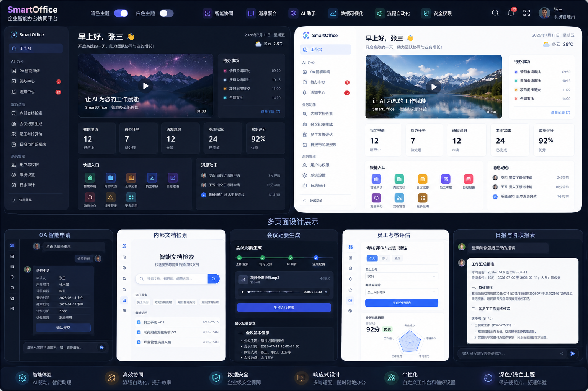

# Smart Office AI Platform

<p align="center">
  <strong>把 OA、知识库、会议、考核、报表和业务消息真正连接起来的智能办公 MVP</strong>
</p>

<p align="center">
  
  
  
  
  
  
</p>

Smart Office AI Platform 是一个面向企业办公场景的全栈智能化平台。它不是单一的聊天机器人，而是一套覆盖“员工发起任务—AI 处理—管理者审批—结果沉淀—消息触达”的完整业务闭环。

项目以 **FastAPI + Vue 3 + SQLite + Dify + 飞书开放平台** 为核心，将多个常见办公场景集中到统一工作台，并通过角色权限、部门隔离、通知中心和操作记录保证不同用户看到正确的信息。

> 当前仓库定位为可运行、可演示、可继续扩展的小型 MVP。员工、合作方、群聊和工作流示例均已使用代号脱敏。


## 项目亮点

- **业务闭环**：OA 申请、审批、通知、待办、报表和消息分流能够互相联动。
- **AI 能力可配置**：不同业务可以绑定独立的 Dify Workflow 或 Advanced Chat 应用，无需把密钥和流程写死在代码中。
- **企业级权限思路**：支持普通员工、部门领导、平台管理员和超级管理员，后端会再次校验权限，不依赖前端隐藏按钮。
- **部门级数据隔离**：员工只查看自己的信息，部门领导处理本部门业务，管理员拥有跨部门管理能力。
- **真实消息渠道接入**：支持飞书事件订阅、消息评分、AI 分类、部门路由、互动卡片和状态回写。
- **前后端完整实现**：不是静态页面，包含数据库、认证、API、异步任务、外部 AI 调用和可运行的 Vue 管理端。
- **可扩展性极强**：AI 提供方、事件来源、数据库和前端功能模块都保留了清晰扩展点，各种功能易添加。

## 功能全景
  
### 1. 智能工作台

统一展示员工当前最重要的信息：

- 待办任务和审批任务；
- 本人的 OA 申请进度；
- 未读通知和部门业务消息；
- 常用 AI 工具快捷入口；
- 工作概览及合作动态；
- 明暗主题自适应首页。

工作台不是简单导航页，而是整个系统的数据聚合入口。

### 2. OA 智能申请

员工可以直接用自然语言描述需求，例如“我要请假”“我要报销”“我要出差”。系统会通过 AI 对话逐步完成：

- 识别申请意图和申请类型；
- 自动生成对应的动态表单；
- 自动绑定当前登录员工和所属部门；
- 保存草稿、修改内容并提交审批；
- 保留 AI 会话上下文；
- 防止冒用其他员工身份发起申请。

这让传统的“找入口—找表单—逐项填写”变成自然语言驱动的申请流程。

### 3. 我的申请与审批中心

- 员工可以查看本人全部申请及实时状态；
- 支持草稿修改、提交和删除；
- 部门领导只处理本部门员工申请；
- 支持同意、驳回和填写审批意见；
- 部门没有负责人时由超级管理员兜底；
- 审批过程生成记录、通知和操作日志。

### 4. 待办中心与通知中心

系统将不同来源的工作统一聚合：

- 待我审批；
- 我的申请进度；
- 部门业务消息；
- OA 审批结果；
- 系统提醒和未读通知；
- 已读、未读状态管理。

用户不需要在多个页面反复查找最新事项。

### 5. 企业内部文档智能检索

连接 Dify 知识库后，员工可以使用自然语言查询制度、流程和内部资料：

- 面向自然语言的问题输入；
- 展示结构化或 Markdown 答案；
- 支持知识库工作流独立配置；
- 根据登录用户权限控制访问；
- AI 服务不可用时提供明确错误提示。

### 6. 会议纪要智能生成

上传会议录音或视频后，系统可以：

- 支持 MP3、WAV、M4A、AAC、FLAC、OGG、WMA、AMR、MP4、MOV；
- 将文件上传至 Dify 工作流；
- 展示节点执行进度；
- 生成会议主题、摘要和关键结论；
- 提取参会人员、决策事项和行动项；
- 将非结构化会议内容转成可执行记录。

### 7. 员工考核出题与智能批阅

围绕员工岗位和考核类型建立完整考核流程：

- 根据员工、考核类型和难度自动生成题目；
- 支持上传员工答卷；
- AI 自动批阅并输出评分结果；
- 生成答题反馈、薄弱项和改进建议；
- 最终结果按部门推送给负责人；
- 使用稳定业务标识去重，避免重复通知。

### 8. 考核分析与培训建议

在单次考核之外，系统还能进一步生成组织层面的分析：

- 个人维度分析；
- 部门维度分析；
- 全员维度分析；
- 汇总薄弱知识点和能力短板；
- 生成分层培训建议；
- 根据角色限制可查询的员工和部门范围。

### 9. 日报与阶段报表助手

员工可提交日常工作内容，AI 帮助整理为标准化结果：

- 个人日报提交与润色；
- 日报、周报、月报和阶段汇总；
- 支持 Markdown 内容展示；
- 可携带员工、项目、客户和事项等查询维度；
- 最终结果按部门推送给管理者；
- AI 会话与业务结果分离，便于后续更换模型。

### 10. 飞书智能消息分流

项目包含一个独立飞书 Worker，能够消费真实飞书消息事件：

- 接收飞书群聊消息并标准化事件结构；
- 基于来源、群聊、关键词和时间进行本地评分；
- 达到阈值后调用 Dify 完成 AI 分类；
- 识别消息所属业务部门；
- 严格按照部门映射投递；
- 生成飞书互动卡片；
- 支持卡片按钮回调和处理状态更新；
- 消息去重、原始记录和异常兜底；
- 同步生成平台内部门通知。

本地规则负责快速判断，AI 负责复杂语义识别，两者结合能减少无意义的模型调用。

### 11. 消息中心与分流仪表盘

- 按权限查看全部消息或本部门消息；
- 查看本地评分、AI 分类和目标部门；
- 修改消息处理状态；
- 汇总消息数量、优先级和处理进度；
- 对消息路由效果进行可视化观察。

### 12. Dify 应用管理

管理员可以直接在网页中管理多个 AI 应用：

- 独立配置 API Base、API Key 和 Endpoint；
- 支持 Workflow、Advanced Chat 和 Chatbot 模式；
- 配置超时、SSL、代理和响应模式；
- 使用 `module_key` 将 AI 应用绑定到具体业务；
- API Key 脱敏展示；
- 在线测试配置是否可用。

新增 AI 场景时不需要继续堆叠环境变量。

### 13. 业务规则配置

管理员可以维护消息分流规则：

- 关键词权重；
- 指定群聊权重；
- 时间段权重；
- 消息来源权重；
- 忽略、推送和紧急阈值；
- 规则启用、停用、创建、修改和删除。

### 14. 员工、角色与权限管理

- 从 CSV 导入员工基础信息；
- 自动创建员工账号和部门；
- 根据岗位关键词识别部门负责人；
- 管理角色、部门、岗位、邮箱和启用状态；
- 管理员重置员工密码；
- 首次登录修改密码；
- 支持操作留痕。

内置角色：

| 角色 | 主要能力 |
|---|---|
| 普通员工 | 使用 AI 工具、发起申请、查看本人数据和部门消息 |
| 部门领导 | 普通员工能力 + 本部门审批、部门分析和结果接收 |
| 平台管理员 | 消息、工作流、规则、员工和平台配置管理 |
| 超级管理员 | 全部权限及异常流程兜底 |

## 技术架构

```text
┌─────────────────────────────────────────────────────────────┐
│                       Vue 3 Web Client                      │
│ 工作台 / OA / 审批 / 知识检索 / 会议 / 考核 / 报表 / 管理端 │
└───────────────────────────┬─────────────────────────────────┘
                            │ HTTP + Bearer Token
┌───────────────────────────▼─────────────────────────────────┐
│                       FastAPI Backend                       │
│ 身份权限 / 业务 API / 通知待办 / 数据隔离 / 工作流配置       │
└───────────────┬───────────────────────┬─────────────────────┘
                │                       │
        ┌───────▼────────┐      ┌───────▼────────────┐
        │ SQLite Storage │      │ Dify AI Platform   │
        │ 用户/业务/日志 │      │ Workflow / Chat   │
        └────────────────┘      └────────────────────┘

┌───────────────────────┐              ┌──────────────────────┐
│ Feishu Event / Callback│─────────────▶│ Feishu Worker       │
│ 消息、卡片按钮、用户事件   │             │ 评分/分类/路由/卡片     │
└───────────────────────┘              └──────────────────────┘
```

## 技术栈

| 层级 | 技术 |
|---|---|
| 前端 | Vue 3、Vite、Element Plus、Axios |
| 后端 | Python 3.12、FastAPI、Pydantic、Uvicorn |
| 数据库 | SQLite |
| AI 编排 | Dify Workflow、Advanced Chat、Chatbot |
| 企业通信 | 飞书开放平台、事件订阅、互动卡片 |
| 权限 | Bearer Token、PBKDF2 密码哈希、RBAC |
| 内容 | Markdown 渲染、结构化 JSON、文件上传、SSE |

## 项目结构

```text
backend/
  web_api.py                       FastAPI 主应用与核心业务接口
  feishu_worker.py                 飞书事件消费与消息处理管线
  auth_system.py                   登录、用户、权限、通知、任务和审批
  db.py                            SQLite 表结构、连接与数据访问
  dify_client.py                   统一 Dify 调用适配器
  document_search_api.py           企业知识检索
  meeting_minutes_api.py           会议文件与纪要生成
  employee_assessment_api.py       考核出题和答卷批阅
  employee_assessment_analysis_api.py  考核分析和培训建议
  report_generate_api.py           日报和阶段报表
  department_result_push.py        部门负责人结果推送
frontend/
  src/components/                  全部业务页面组件
  src/api/                         前端 API 客户端
  src/auth.js                      登录态和权限辅助函数
scripts/
  manage.py                        配置、数据库和 AI 诊断命令
  bootstrap.py                     Python 环境安装辅助工具
  public_release_check.py          公开发布隐私检查
data/
  *.example.*                      可公开的脱敏示例
tests/                             MVP 回归及发布安全测试
```

根目录的 `web_api.py` 和 `main.py` 是兼容入口，原有启动方式仍然有效。

## 快速开始

### 1. 获取代码

```bash
git clone https://github.com/zsh0916/OSshareMVP.git
cd OSshareMVP
```

### 2. 创建 Python 环境

Windows PowerShell：

```powershell
py -3.12 -m venv .venv
.\.venv\Scripts\Activate.ps1
python -m pip install -r requirements.txt
```

### 3. 创建本地配置

```powershell
Copy-Item .env.example .env
Copy-Item data\employee_info.example.csv data\employee_info.csv
```

然后根据自己的环境修改 `.env`。Demo 至少配置：

```env
APP_ENV=demo
APP_ADMIN_USERNAME=admin
APP_ADMIN_PASSWORD=your-demo-password
APP_JWT_SECRET=replace-with-a-random-string
APP_CORS_ORIGINS=http://localhost:5173
```

飞书和 Dify 功能需要另外填写对应的 App ID、App Secret、群聊 ID、API Base 和 API Key。

### 4. 启动后端

```powershell
.\.venv\Scripts\python.exe -m uvicorn backend.web_api:app --reload --port 8000
```

也可以双击：

```text
start_backend.bat
```

API 文档：

```text
http://localhost:8000/docs
```

### 5. 启动前端

```powershell
cd frontend
npm install
npm run dev
```

也可以双击 `start_frontend.bat`。默认访问：

```text
http://localhost:5173
```

### 6. 启动飞书 Worker（可选）

完成飞书配置后，在项目根目录执行：

```powershell
.\.venv\Scripts\python.exe main.py
```

## 常用维护命令

```powershell
# 检查 .env 和公开规则配置
python -m scripts.manage check-config

# 初始化或检查数据库
python -m scripts.manage init-db

# 查看已提交 OA 数据
python -m scripts.manage inspect-oa

# 测试指定 AI 工作流
python -m scripts.manage check-ai WORKFLOW_ALIAS "示例问题"

# 检查公开仓库是否可能包含敏感 ID
python -m scripts.public_release_check

# 运行 MVP 回归测试
python -m unittest discover -s tests -v

# 前端生产构建
cd frontend
npm run build
```

## 扩展新的 AI 功能

项目已经预留了清晰的扩展方式：

1. 在 Dify 创建新的 Workflow 或 Chat 应用；
2. 在平台“Dify 应用管理”中新增配置；
3. 为应用设置唯一的 `module_key`；
4. 新建一个 FastAPI `APIRouter` 业务模块；
5. 通过 `dify_client.py` 发起统一调用；
6. 在 Vue 中增加异步加载的功能页面。

能力发现接口：

```http
GET /api/meta/capabilities
```

后续可以继续扩展 PostgreSQL、Redis、Celery、其他大模型平台、企业微信或钉钉事件适配器。

## 数据和隐私说明

仓库只应包含脱敏示例。以下文件属于本地运行数据，已通过 `.gitignore` 排除：

```text
.env
.venv/
frontend/node_modules/
frontend/dist/
data/messages.db
data/employee_info.csv
data/employee_initial_accounts.csv
data/received_messages.ndjson
```

请勿把真实员工信息、聊天记录、飞书密钥、Dify API Key 或生产数据库提交到公开仓库。

## 当前定位

这是一个以“功能闭环和扩展能力”为重点的 MVP：

- 已覆盖主要办公智能化流程；
- 适合本地演示、课程设计、毕业设计、原型验证和二次开发；
- SQLite 适合当前规模，正式生产可替换为 PostgreSQL；
- 外部 AI 和飞书功能需要使用者提供自己的服务配置；
- 后续可继续补充 Docker、CI/CD、自动化测试和生产级部署方案。

## License

项目为作者兴趣爱好所原创。如果这个项目对你有启发，欢迎 Star、Fork，或基于它继续构建自己的智能办公平台。
